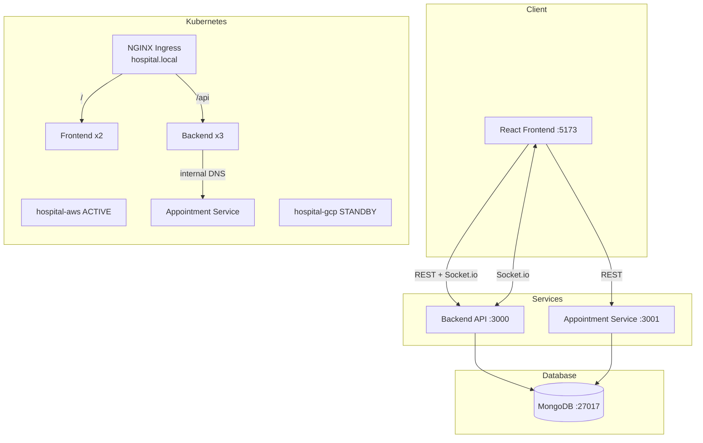

# Healthcare Management System

University Final Project — Week 11 + Week 12

## Quick Start

```bash
# Start all services
docker compose up --build

# Seed the database (run after services are up)
docker exec healthcare-backend npm run seed

# Access
# Frontend:           http://localhost:5173
# Backend API:        http://localhost:3000
# Appointment API:    http://localhost:3001
```

**Default credentials (after seed):**
| Role   | Email                   | Password     |
|--------|-------------------------|--------------|
| Doctor | doctor@hospital.com     | password123  |
| Nurse  | nurse@hospital.com      | password123  |

---

## Architecture Diagram



---

## VPC Blueprint

```
┌─────────────────────────────────────────────────────────────┐
│  VPC: 10.0.0.0/16                                           │
│                                                             │
│  ┌─────────────────────┐   ┌─────────────────────────────┐ │
│  │  Public Subnet      │   │  Private Subnet             │ │
│  │  10.0.1.0/24        │   │  10.0.2.0/24                │ │
│  │                     │   │                             │ │
│  │  ┌───────────────┐  │   │  ┌──────────────────────┐  │ │
│  │  │  NGINX Ingress│  │   │  │  Backend (x3)        │  │ │
│  │  │  LoadBalancer │  │   │  │  Appointment (x2)    │  │ │
│  │  └───────┬───────┘  │   │  │  Frontend (x2)       │  │ │
│  │          │           │   │  └──────────┬───────────┘  │ │
│  └──────────┼───────────┘   └─────────────┼───────────────┘ │
│             │                              │                 │
│             └──────────────────────────────┘                 │
│                                                             │
│  ┌─────────────────────────────────────────────────────┐   │
│  │  Data Subnet 10.0.3.0/24                            │   │
│  │  MongoDB ReplicaSet (Primary + 2 Secondary)         │   │
│  └─────────────────────────────────────────────────────┘   │
└─────────────────────────────────────────────────────────────┘
```

---

## API Reference

### Auth (`/api/auth`)
| Method | Endpoint          | Auth | Description           |
|--------|-------------------|------|-----------------------|
| POST   | /register         | No   | Register new user     |
| POST   | /login            | No   | Login, sets JWT cookie|
| POST   | /logout           | Yes  | Clear auth cookie     |
| GET    | /me               | Yes  | Current user info     |

### Patients (`/api/patients`)
| Method | Endpoint          | Auth | Description           |
|--------|-------------------|------|-----------------------|
| GET    | /                 | Yes  | List all patients     |
| GET    | /stats            | Yes  | Patient statistics    |
| GET    | /:id              | Yes  | Get single patient    |
| POST   | /                 | Yes  | Create patient        |
| PUT    | /:id              | Yes  | Update patient        |
| DELETE | /:id              | Yes  | Delete patient        |

### Medical Records (`/api/medical-records`)
| Method | Endpoint          | Auth | Description           |
|--------|-------------------|------|-----------------------|
| GET    | /                 | Yes  | List all records      |
| GET    | /:id              | Yes  | Get single record     |
| POST   | /                 | Yes  | Create record         |
| PUT    | /:id              | Yes  | Update record         |
| DELETE | /:id              | Yes  | Delete record         |

### Appointments (port 3001, `/api/appointments`)
| Method | Endpoint          | Auth | Description                   |
|--------|-------------------|------|-------------------------------|
| GET    | /                 | No   | List appointments (?today=true)|
| GET    | /stats            | No   | Appointment statistics        |
| GET    | /:id              | No   | Get single appointment        |
| POST   | /                 | No   | Book appointment              |
| PUT    | /:id              | No   | Update appointment            |
| DELETE | /:id              | No   | Cancel appointment            |

---

## Week 11 Features

- **Dashboard** — Total patients, today's appointments, urgent cases, pending records
- **Patient CRUD** — Full create/read/update/delete with optimistic status updates
- **Appointment CRUD** — Separate microservice on port 3001
- **Medical Records CRUD** — Linked to patients with doctor/prescription data
- **JWT Auth** — HTTP-only cookies, bcrypt hashing, protected routes
- **Database Seed** — `npm run seed` loads 2 users, 5 patients, 3 records
- **Jest Tests** — Auth and Patient endpoint tests
- **Docker Compose** — Single command startup with health checks

## Week 12 Features

- **React Query** — `useQuery`/`useMutation` on all endpoints, optimistic updates on patient status
- **Socket.io** — Real-time sync: patient/record events broadcast to all connected clients
- **Kubernetes** — 3-replica backend, 2-replica frontend, NGINX Ingress
- **TLS** — Self-signed cert via `tls-secret` K8s Secret
- **Namespaces** — `hospital-aws` (ACTIVE), `hospital-gcp` (STANDBY)
- **Internal DNS** — `http://appointment-service.hospital-aws.svc.cluster.local:3001`

---

## Kubernetes Setup (Minikube)

```bash
# Start minikube
minikube start

# Enable ingress addon
minikube addons enable ingress

# Build images into minikube's Docker
eval $(minikube docker-env)
docker build -t healthcare-backend:latest ./backend
docker build -t healthcare-frontend:latest ./frontend
docker build -t appointment-service:latest ./appointment-service

# Create namespaces
kubectl apply -f k8s/namespaces/

# Generate TLS certificate
openssl req -x509 -nodes -days 365 -newkey rsa:2048 \
  -keyout tls.key -out tls.crt \
  -subj "/CN=hospital.local/O=hospital"
kubectl create secret tls tls-secret --cert=tls.crt --key=tls.key -n hospital-aws

# Create JWT secret
kubectl create secret generic healthcare-secrets \
  --from-literal=jwt-secret=supersecretjwt2024healthcare \
  -n hospital-aws

# Deploy all resources (includes MongoDB, backend, appointment-service, frontend, ingress)
kubectl apply -f k8s/namespaces/
kubectl apply -f k8s/mongo-service.yaml
kubectl apply -f k8s/mongo-deployment.yaml
kubectl apply -f k8s/

# Add to /etc/hosts (or C:\Windows\System32\drivers\etc\hosts)
echo "$(minikube ip) hospital.local" | sudo tee -a /etc/hosts

# Access at https://hospital.local
```

---

## Running Tests

```bash
cd backend
npm install
MONGO_URI=mongodb://localhost:27017/healthcare_test JWT_SECRET=testsecret npm test
```

## Cloud Deployment

### Frontend → Netlify

1. Connect your GitHub repo in the [Netlify dashboard](https://app.netlify.com).
2. Netlify auto-detects `netlify.toml` at the repo root — no manual configuration needed:
   - **Base directory:** `frontend`
   - **Build command:** `npm run build`
   - **Publish directory:** `dist`
   - All routes redirect to `index.html` (SPA support).
3. After deploy, copy the Netlify URL (e.g. `https://your-app.netlify.app`) and set it as an environment variable on your backend services:
   ```
   FRONTEND_URL=https://your-app.netlify.app
   ```

### Backend + Appointment Service → Render

1. Connect your GitHub repo in the [Render dashboard](https://render.com).
2. Render reads `render.yaml` at the repo root and creates two web services:
   - `healthcare-backend` (root: `backend`, port 3000)
   - `healthcare-appointments` (root: `appointment-service`, port 3001)
3. Set these environment variables for each service in the Render dashboard:
   | Variable | Description |
   |---|---|
   | `MONGODB_URI` | MongoDB Atlas connection string (see below) |
   | `JWT_SECRET` | Long random string for signing JWT tokens |
   | `FRONTEND_URL` | Your Netlify URL |
4. For `healthcare-backend`, also set:
   | Variable | Value |
   |---|---|
   | `APPOINTMENT_SERVICE_URL` | Render URL of `healthcare-appointments` |

### Database → MongoDB Atlas

1. Create a free cluster at [cloud.mongodb.com](https://cloud.mongodb.com).
2. Create two databases on the cluster: `healthcaredb` and `appointmentsdb`.
3. Create a database user and whitelist `0.0.0.0/0` (or Render's IP range) in Network Access.
4. Copy the connection string and set it as `MONGODB_URI` on both Render services:
   ```
   mongodb+srv://<user>:<password>@cluster0.xxxxx.mongodb.net/healthcaredb?retryWrites=true&w=majority
   ```
   For the appointment service use `/appointmentsdb` in the connection string.
5. Run the seed script once after deployment:
   ```bash
   MONGODB_URI=<atlas-uri> APPOINTMENTS_MONGODB_URI=<atlas-appointments-uri> npm run seed
   ```

---

## Project Structure

```
healthcare-system/
├── frontend/            React + Vite + React Query + Socket.io
├── backend/             Node.js + Express + MongoDB + Socket.io
├── appointment-service/ Node.js + Express + MongoDB (port 3001)
├── k8s/                 Kubernetes manifests
├── netlify.toml         Netlify frontend deployment config
├── render.yaml          Render backend deployment config
└── .github/workflows/   GitHub Actions CI
```
